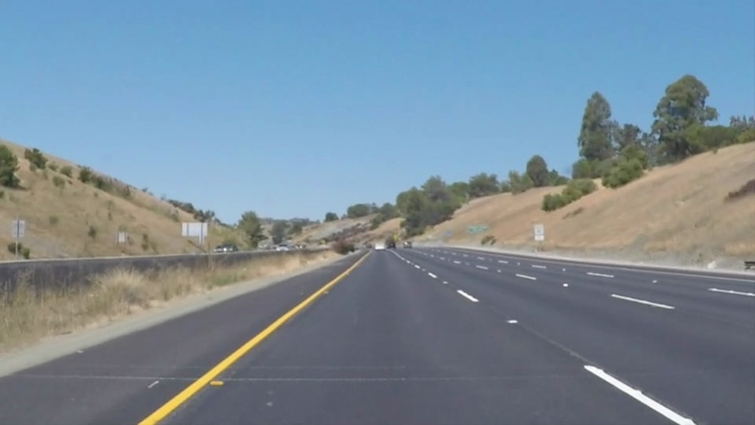

## Steps
1. Convert RGB frame to GRAY frame.
2. Applying a **Gaussian Blur** to remove noise and smoothen image.
3. Applying the **Canny Edge Detector** to find edges in the image based on duel thresholds.
4. Passing the canny image through **Hough Transform** to infer lines.
5. Using the infered lines we compute the best fitting lane line (i.e. left lane and right lane).
6. The computed lane lines are drawn on a dark background and the required region of interest is extracted.
7. The extracted region is overlaid on the original image using **addWeighted** and produced as the output frame.

  

## Input image

  

## Output image

